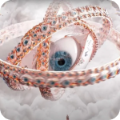

<div align="center">


# Steply &amp; LucasHiago

**Arquitetura, produto e código com propósito.**

12+ anos resolvendo problemas reais com engenharia sólida — não com framework da moda.

<br />

[](https://steply.com.br)
[](https://www.lucashiago.com.br)
[](https://asteroth.com.br)
[](https://www.linkedin.com/in/lucashdsf/)
[](https://github.com/sponsors/LucasHiago)

</div>

---

Dois universos que se cruzam: **Steply** — operação de outsourcing técnico e desenvolvimento de produto para fundadores que precisam de execução, não de promessa — e **LucasHiago**, a identidade técnica por trás das decisões. Backend que é regra de negócio, frontend que é estado e performance, infra que existe pra **não** ser percebida.

> **Código é uma consequência. Arquitetura é uma decisão. Produto é um compromisso.**

---

## 🛠️ Stack


Angular quando o projeto exige estado complexo e vida longa · Next.js quando a prioridade é performance e SEO · NestJS no coração de quase tudo · PostgreSQL quando o domínio é sério, `+ pgvector` quando entra IA · C++ no engine do Asteroth · Python no eixo de IA e gamedev tooling.

---

## 🆕 No que estou trabalhando agora <sub>(2025–2026)</sub>

Além de operar a Steply, abri três frentes próprias que mudaram como eu trabalho: um **MMORPG autoral em engine própria**, um **framework de processo spec-driven** e um **eixo de IA aplicada com MCP + Blender + agentes**.

### 🜏 Asteroth — MMORPG isométrico em planeta esférico

Em desenvolvimento desde **2012**, em engine própria **C++**, sem publisher, sem prazo imposto. O diferencial não é estética: o jogador caminha em volta de uma **esfera real** — horizonte curvo, sol nascendo, duas luas atravessando o céu. **Não é skybox falso, é geometria de planeta.** Civilização 100% player-driven, panteão de 26 governantes.

📖 **[`asteroth-public`](https://github.com/LucasHiago/asteroth-public)** — lore, panteão e 17 concept arts &nbsp;·&nbsp; 🔒 `asteroth-learnings` — ~147 docs de pesquisa + pipeline `lowpoly_generator` &nbsp;·&nbsp; 🔒 `Asteroth` — engine + jogo

<details>
<summary><b>Abrir os três repositórios do projeto</b></summary>

<br />

**🌍 [`asteroth-public`](https://github.com/LucasHiago/asteroth-public) — o canal externo.** Aqui não tem código de jogo, tem **mundo**:
- **Lore cosmogônica** ([`LORE.md`](https://github.com/LucasHiago/asteroth-public/blob/main/LORE.md)) — a origem das partículas, Asteroth como entidade, o planeta físico.
- **Os Governantes** ([`GOVERNANTES.md`](https://github.com/LucasHiago/asteroth-public/blob/main/GOVERNANTES.md)) — panteão de 26 entidades, cada uma com condição de despertar própria.
- **Mecânicas** ([`GAMEPLAY.md`](https://github.com/LucasHiago/asteroth-public/blob/main/GAMEPLAY.md)) — classes, fama, ciclo `explorar → coletar → construir → defender → ser invadido → reconstruir`.
- **Contos** ([`stories/`](https://github.com/LucasHiago/asteroth-public/tree/main/stories)) e **17 concept arts** ([`concepts/worlds/`](https://github.com/LucasHiago/asteroth-public/tree/main/concepts/worlds)), cada um com vinheta curta.

<p align="center">
  
  
  
  
  
</p>
<p align="center"><sub>5 dos 26 governantes do panteão de Asteroth</sub></p>

**🧪 `asteroth-learnings` 🔒 — pesquisa fundacional.** ~147 documentos em 9 pilares (renderização iso, movimento iso, networking, ECS, física, mundo esférico, biomas, infra MMO, integração de stack). Highlight: o **`lowpoly_generator`**, pipeline em produção que converte sprite-sheet ortográfica em mesh low-poly 3D fiel à arte:

```text
sprite sheet ortográfico
   ↓ slice_sheets.py (Blender)
slices + metadata (bbox + m_per_px)
   ↓ 01_extract/ — 8 features por slice
silhouette · keypoints · edges · palette · depth · normals · parts · symmetry
   ↓ 02_fuse/ — landmarks 3D + visual hull
   ↓ 06_ai/run_hunyuan_cloud.py
Hunyuan3D-2 multi-view via HF Space (~5s)
   ↓ postprocess: decimate (~2k tris) + rescale métrico
character.glb pronto pra engine
```

A descoberta central: **CV clássico (visual hull + primitives + shrinkwrap) bate na parede em fidelidade artística.** A solução foi inverter o paradigma — usar o pipeline pra preparar inputs alinhados (3 vistas em escala métrica + landmarks) e delegar a inferência 3D pra uma IA multi-view. **Híbrido CV + IA generativa** entrega resultado em segundos.

**🔒 `Asteroth` — engine + jogo (privado).** Engine própria em C++, atualmente na **Fase 0: Fundação 3D** (pipeline de renderização — cubo isométrico, depth test, sistema de mesh). Roadmap até infra MMO (Fase 5) e conteúdo (Fase 6+). Stack consolidada em ~22 libs C++ defensivamente avaliadas (Flecs, Jolt, GNS, etc).

</details>

### 🏛️ Steply SDD Harness — spec-driven development como SO do processo &nbsp;<sub>🔒</sub>

O arcabouço que rege como Steply (e Asteroth) saem do papel. Não é metodologia em slide — é um conjunto de regras, templates e ferramentas executáveis que estrutura **épico → issue → spec → código**, tudo rastreável via GitHub CLI e versionado no Git. Porque **arquitetura sem processo vira folclore.**

<details>
<summary><b>O que ele entrega</b></summary>

<br />

- **Hierarquia explícita**: Fase (F#) → Épico (E# = Milestone + Discussion) → Issue → PR. Nenhuma issue órfã.
- **Templates de épico e spec** que padronizam tracking entre Asteroth, Steply e laterais.
- **Style guide arquitetural** — design system Steply replicável (CSS variables, dark/light, tokens).
- **Tooling automatizado** (`bulk_create_epics.py`, `spec_report.py`, `sync_design_specs.py`) — épicos em lote, relatórios de progresso, sincronização de specs entre repos.
- **ERD versionado** como source-of-truth de domínio + **roteiros de implantação** (n8n em VPS e AWS).

Força clareza de escopo antes do commit, deixa rastro auditável das decisões e reduz drasticamente o custo de onboard em projetos longos.

</details>

### 🤖 IA aplicada — MCP, Blender e agentes

Não como buzzword. Como ferramenta de produção.

<details>
<summary><b>🎬 <code>anime-maker</code> — pipeline <code>prompt → MP4</code> via MCP + Blender 🔒</b></summary>

<br />

Pipeline pra **criar animes** controlando Blender remotamente via **Model Context Protocol** (MCP stdio):

1. IA gera concept art 2D do personagem (Fal.ai)
2. IA converte imagem → modelo 3D rigado (Meshy.ai, image-to-3d + auto-rigging)
3. Blender controlado via MCP monta a cena, aplica animação pronta (walk/run)
4. Render **NPR vanilla** (Toon BSDF via Shader-to-RGB + ColorRamp + Freestyle), câmera ortográfica pra "sensação 2D" anime
5. Frames PNG + MP4 (ffmpeg) saem prontos por episódio

CLI Typer end-to-end. Stack: Python 3.10+ · Typer · MCP · Blender · Meshy.ai. É a **prova de conceito** de que MCP + Blender + image-to-3D monta um pipeline cinematográfico controlado por linguagem natural, sem operador artista no loop.

</details>

<details>
<summary><b>🧠 <code>agentes-langchain-lab</code> — agentes do zero, sem framework escondendo as engrenagens 🔒</b></summary>

<br />

```text
   pergunta ──► researcher ───► writer ──► resposta
                 │ tool: search_docs
                 ▼
           PGVector (pg16) ← embeddings MiniLM (384d)
```

- Orquestração: **LangGraph** (`StateGraph`) — fluxo entre agentes explícito e inspecionável
- Agentes: **LangChain** `create_react_agent` (loop ReAct)
- LLM: **Claude Haiku 4.5** · Vector store: **PostgreSQL + pgvector** · Embeddings: **MiniLM-L6-v2** local
- Infra: Docker Compose, `up -d` e tá pronto

O ponto: trocar peças (LLM, tool, vetor, política de roteamento) e ver o efeito imediato, sem framework de alto nível escondendo o que acontece.

</details>

📚 **[`SKILLS`](https://github.com/LucasHiago/SKILLS)** — skills públicas no padrão Claude Code, baseadas nos artigos do `lucashiago.com.br` e focadas em fluxo Steply.

---

## 🧠 Filosofia de engenharia

- Simplicidade antes de abstração
- Escala pensada desde o MVP
- Código legível vence código esperto
- Frontend não é só UI — é estado, performance e experiência
- Backend não é CRUD — é regra de negócio
- Infra existe para **não ser percebida**

---

<details>
<summary><h3>📦 Ecossistema &amp; histórico — produtos em produção e no forno</h3></summary>

<br />

**Steply em produção e em desenvolvimento:**

- **`services.steply.pm2`** — orquestração PM2 dos serviços Steply (realtime chat com WebRTC + ICE relay, blog publisher SSR, integrações).
- **`build-market-business` (frontend / dashboard)** — produto B2B em React.
- **`main.steply.build`** — site institucional · **`lp.email.sender`** — disparador de campanhas próprio · **[`lucashiago.resume`](https://github.com/LucasHiago/lucashiago.resume)** — currículo como HTML versionado.
- **[`integration-mercado-pago-nestjs`](https://github.com/LucasHiago/integration-mercado-pago-nestjs)** — integração de pagamentos NestJS.

**Históricos que ainda ensinam (e às vezes ainda rodam em produção):**

- **[`galax-api`](https://github.com/LucasHiago/galax-api) / [`galax-commerce`](https://github.com/LucasHiago/galax-commerce)** — núcleo NestJS + camada de e-commerce desacoplada, backend-first.
- **Poker Electron** — desktop multiplataforma, prova de que Electron não é gambiarra quando bem arquitetado.
- **NFMEI** — sistema fiscal pra microempreendedores, simplificando o que sistemas enterprise complicam.
- **Fashion Manager** — gestão de coleções e estoque; o desafio era traduzir negócio específico pra software sem forçar o cliente a se adaptar.
- **docsModule (NestJS)** — módulo reutilizável de documentação viva de APIs.

</details>

<details>
<summary><h3>🏗️ Consultoria &amp; operação técnica</h3></summary>

<br />

Além dos projetos autorais, entro em projetos onde o escopo já estava atrasado, o código já estava frágil e a arquitetura já tinha dado sinais de colapso.

Aplicações típicas: sistemas administrativos, backoffices complexos, dashboards operacionais, migração de legado, reestruturação de código caótico, performance tuning de banco — prazo curto com impacto real.

</details>

---

## 📖 Livro autoral

Sou autor de um livro próprio. Não é tutorial de framework — é sobre **fundamentos reais de software, engenharia e pensamento técnico**: como pensar sistemas antes de escrever código, como evitar decisões técnicas irreversíveis, como diferenciar complexidade necessária de complexidade inútil. Escrito a partir de projetos reais — os que escalaram, os que quebraram, os que ensinaram mais do que sucesso.

> Software não é sobre ferramentas. É sobre decisões.

---

## 🧭 O fio condutor

Todos esses projetos compartilham algo: código que alguém vai manter, arquitetura que explica decisões, produto que respeita o usuário, engenharia que respeita o tempo. Nem tudo vira vitrine — mas tudo vira **base**.

**Steply é o veículo. Asteroth é a obra de longo prazo. LucasHiago é o arquiteto.**

---

<div align="center">

[](https://steply.com.br)
[](https://www.lucashiago.com.br)
[](https://asteroth.com.br)
[](https://www.linkedin.com/in/lucashdsf/)

<br /><br />

<sub><i>Software não é arte abstrata. É engenharia aplicada ao mundo real.<br />Projetos passam. Arquitetura fica.</i></sub>

</div>
